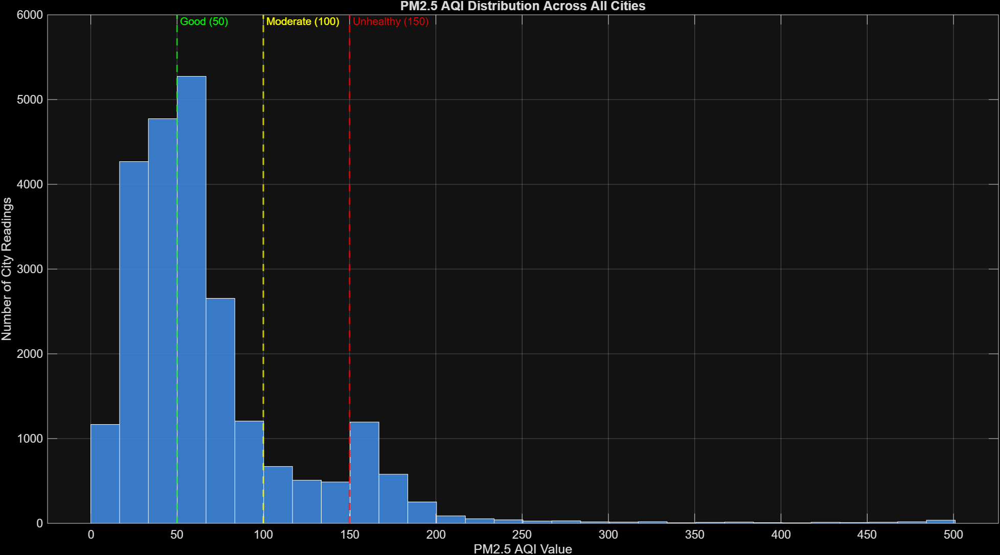
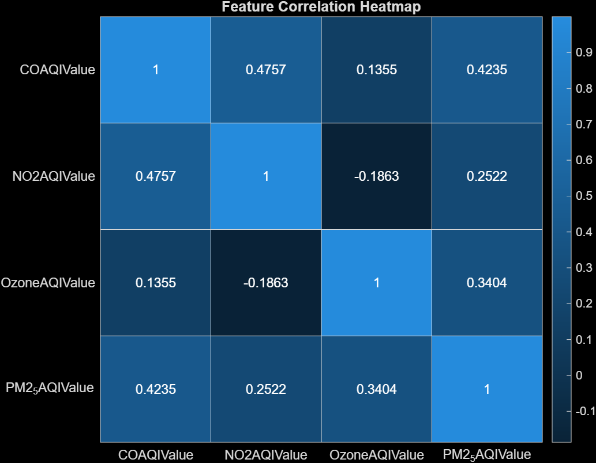
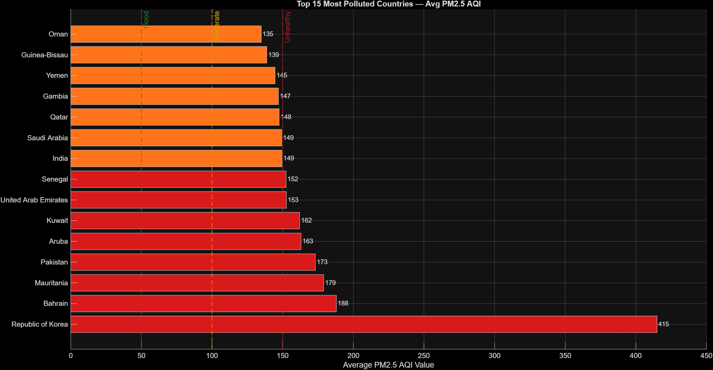
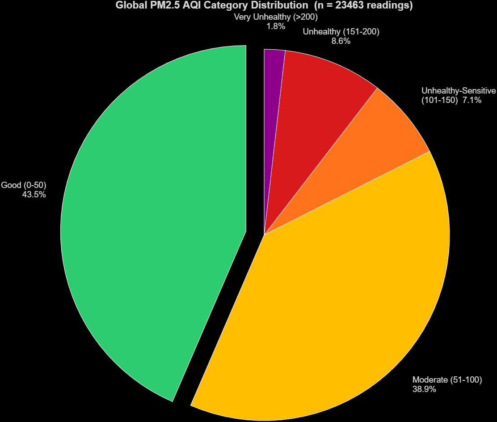

# 🌍 Global Air Pollution Analysis using MATLAB

Exploratory data analysis of global PM2.5 air quality using the [Global Air Pollution Dataset](https://www.kaggle.com/datasets/hasibalmuzdadid/global-air-pollution-dataset). The project preprocesses multi-pollutant readings from cities worldwide, analyses feature correlations, and visualises pollution patterns across cities and countries.

---

## Project Structure

```
Matlab/
├── data/
│   └── GlobalAirPollutionDataset.csv   # Raw dataset (23,463 readings)
├── src/
│   ├── main.m                          # Entry point — runs the full pipeline
│   ├── preprocess.m                    # Data cleaning, normalisation, train/test split
│   ├── train_model.m                   # Linear regression model (CO, Ozone, NO2 → PM2.5)
│   ├── visualize_data.m                # All 4 exploratory figures
│   ├── evaluate_model.m                # Model evaluation stub
│   └── lstm_forecast.m                 # Forecasting stub
└── results/                            # Output figures saved here
```

---

## Pipeline

```
Raw CSV  →  preprocess.m  →  visualize_data.m  →  train_model.m
             │                  │
             │                  └── 4 figures (distribution, correlation,
             │                       countries, AQI breakdown)
             └── 80/20 train-test split, z-score normalisation
```

---

## Visualisations

### 1. PM2.5 AQI Distribution
Shows how PM2.5 readings are distributed across all cities, with WHO threshold lines marking Good (50), Moderate (100), and Unhealthy (150) boundaries. The right-skewed distribution reveals most cities fall in the Good–Moderate range, but a significant tail extends into hazardous levels.



---

### 2. Feature Correlation Heatmap
Pearson correlation between the four pollutants after z-score normalisation. CO and NO2 show moderate positive correlation with PM2.5 (0.42 and 0.25), both driven by combustion sources. Ozone shows a weak negative correlation with NO2 (−0.19), consistent with known photochemical chemistry where NO titrates O₃.



---

### 3. Top 15 Most Polluted Countries
Average PM2.5 AQI per country, sorted descending and colour-coded by WHO severity band. Republic of Korea leads at 415 (likely data anomaly worth investigating), followed by Bahrain (188) and Mauritania (179) — all in the Unhealthy band (>150).



---

### 4. Global AQI Category Breakdown
Proportion of all 23,463 readings falling into each WHO PM2.5 category. 43.5% of readings are Good, 38.9% Moderate — but 17.5% are already in Unhealthy ranges, highlighting the scale of the air quality problem globally.



---

## How to Run

1. Clone the repository
2. Open MATLAB and navigate to the `src/` folder
3. Run:
```matlab
main
```

> **Requirements:** MATLAB R2020b or later. No additional toolboxes required.

---

## Dataset

| Property | Value |
|---|---|
| Source | Kaggle — Global Air Pollution Dataset |
| Readings | 23,463 city-level entries |
| Countries | 130+ |
| Features used | CO AQI, Ozone AQI, NO2 AQI, PM2.5 AQI |
| Target variable | PM2.5 AQI Value |

---

## Insights

- **82.4%** of global city readings fall within the Good or Moderate PM2.5 range
- **17.5%** of readings exceed AQI 100 — posing real health risks, particularly for sensitive groups
- **CO is the strongest predictor** of PM2.5 (r = 0.42), suggesting shared combustion sources
- **Ozone behaves differently** from other pollutants — low correlation with PM2.5 and negative correlation with NO2, driven by photochemistry rather than direct emission
- Middle Eastern and West African countries dominate the most-polluted list, likely driven by desert dust and industrial activity

---

## 👤 Author - Sarah Syeda

Built as a data analysis project in MATLAB to explore global air quality patterns and practice end-to-end data pipelines.
